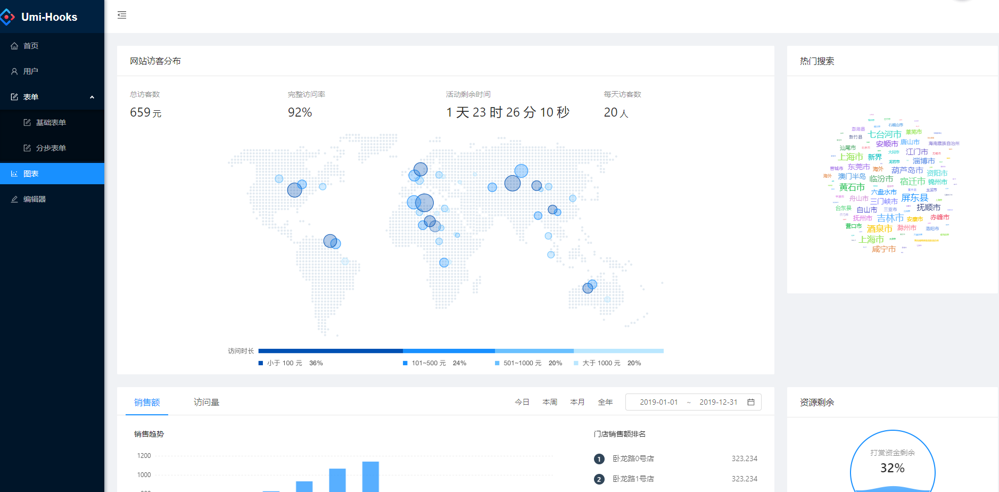

# Umi-Hooks

<p align="center">
  <a href="https://github.com/umijs/umi">
    
  </a>
  <a href="https://github.com/facebook/react">
    
  </a>
  <a href="https://github.com/ant-design/ant-design">
    
  </a>
  <a href="https://www.typescriptlang.org/">
    
  </a>
</p>

## 总览

`Umi-Hooks`是一个中后台前端解决方案，它基于 [umi](https://github.com/umijs/umi), [react](https://github.com/facebook/react), [typescript](https://www.typescriptlang.org/) 和 [ant-design](https://github.com/ant-design/ant-design)实现。

## 截图



## 功能

```txt
- 组件
  - 基础表格
  - ECharts 图表
  - 表单
    - 基础表单
    - 分步表单
  - 编辑器

- 控制台
- 错误页面
  - 404
```

## 前序准备

你需要在本地安装 [node](http://nodejs.org/) 和 [git](https://git-scm.com/)。本项目技术栈基于 [typescript](https://www.typescriptlang.org/)、[react](https://reactjs.org/)、[dva](https://dvajs.com/guide/)、[umi](https://umijs.org/zh/) 和 [ant-design](https://ant.design/index-cn)，所有的请求数据都使用`umi`自带的mock数据功能进行模拟，具体可参考`https://umijs.org/zh/guide/mock-data.html`，提前了解和学习这些知识会对使用本项目有很大的帮助。

## 目录结构

```

|-- umi-hooks
    |-- .editorconfig
    |-- .env            # 环境变量配置
    |-- .eslintrc       # eslint 配置
    |-- .gitignore
    |-- .prettierignore
    |-- .prettierrc
    |-- .umirc.ts       # umi 配置，同 config/config.js，二选一
    |-- package.json
    |-- README.md
    |-- tsconfig.json   # typescript 配置
    |-- tslint.yml      
    |-- typings.d.ts    # 声明文件
    |-- yarn.lock
    |-- dist
    |-- mock            # 模拟数据
    |-- public
    |-- src
        |-- app.ts      # 运行时配置文件
        |-- global.css  # 约定的全局样式文件，自动引入，也可以用 global.less
        |-- assets      # 静态资源
        |-- commonStyle # 公共样式
        |-- components  # 组件
        |-- layouts     # 全局布局
        |-- models
        |-- pages       # 页面目录，里面的文件即路由
        |-- services    # 接口服务
        |-- types       # 类型定义文件
        |-- utils       # 工具类
```

## 如何设置以及启动项目

### 安装依赖

```
yarn
```

### 启动本地开发环境（自带热启动）

```
yarn start
```

### 构建生产环境(自带压缩)

```
yarn run build
```

### 执行测试

```
yarn run test
```

### 自定义配置

请看 [Configuration Reference](https://umijs.org/zh/config/).